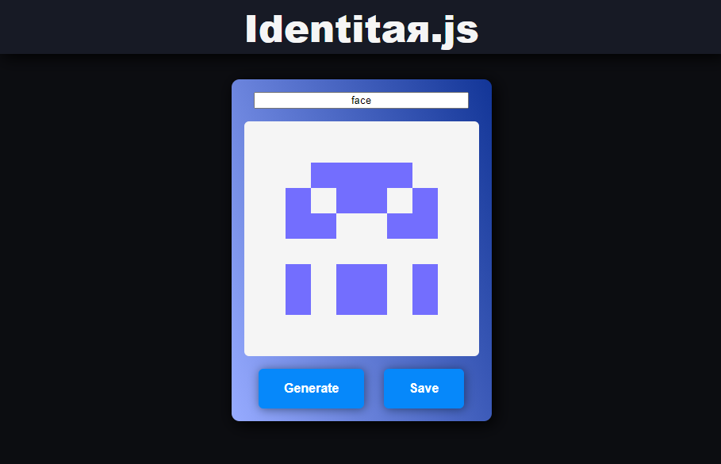

# Identitar.js

**[See the actual project here](https://leopnt.github.io/identitar.js/)**

Generates Github-like identicons from a randomly generated md5 hash.

I originally made a mistake that led to a surprising behaviour 🤗 there is a tendency to create faces or body shapes.
You can also provide a custom text to get your identicon!

## License

This script uses md5.js and p5.js available under the following licenses:
 - https://github.com/crypto-browserify/md5.js/blob/master/LICENSE
 - https://github.com/processing/p5.js/blob/main/license.txt

